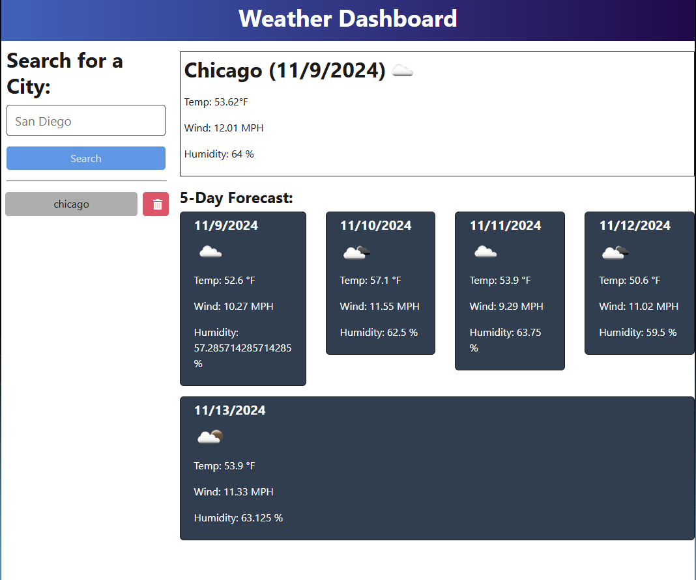

# Weather Dashboard


## Description

The Weather Dashboard is a web application that allows users to search for current and future weather conditions for multiple cities. Users can view the city name, date, weather conditions, temperature, humidity, and wind speed. The application also maintains a search history, allowing users to quickly access previously searched cities.

## Table of Contents
- [Installation](#installation)
- [Deployment](#deployment)
- [Contributing](#contributing)
- [License](#license)
- [Deployed Page](#deployed-page)
- [Questions](#questions)

## Installation

To install the necessary dependencies, follow these steps:

1. Clone the repository:
    ```bash
    git clone [https://github.com/mohsinansare/Weatherinquirych9]
    ```
2. Navigate to the project directory:
    ```bash
    cd weather-dashboard
    ```
3. Install the dependencies for both the client and server:
    ```bash
    npm run install
    ```
4. Building on local  :
    ```bash
    npm run build
    ```
5. Running the Server
    ```bash
    npm run server
    ```

## Deployment

To deploy the application to Render, follow these steps:

1. Create a new web service on Render for the server:
    - Connect your GitHub repository.
    - Set the build command to `npm run build`.
    - Set the start command to `npm start`.
    - Add the following environment variables:
        - `API_BASE_URL=https://api.openweathermap.org`
        - `API_KEY=your_openweather_api_key`

## Contributing

Base files were provided by © 2024 edX Boot Camps

## License
This project is licensed under the [MIT License](https://opensource.org/license/mit).

## Deployed Page

https://weather-dashboard-atag.onrender.com/


## Questions
For any questions, please contact me with the information below:

GitHub repository: https://github.com/mohsinansare/Weatherinquirych9

Email: mohsinansare@gmail.com

Link: https://weather.html

____________________________________
© 2024 Pink727. All Rights Reserved.
